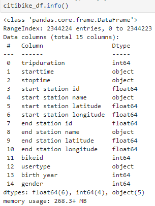
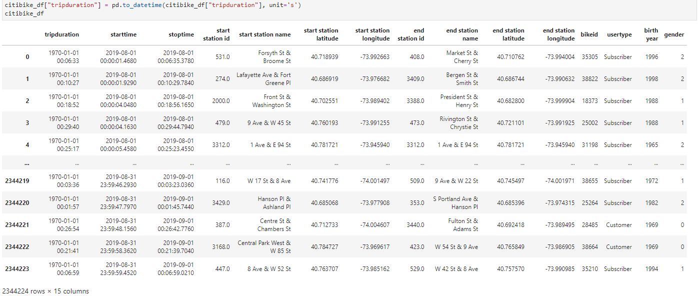
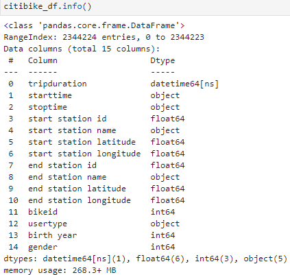
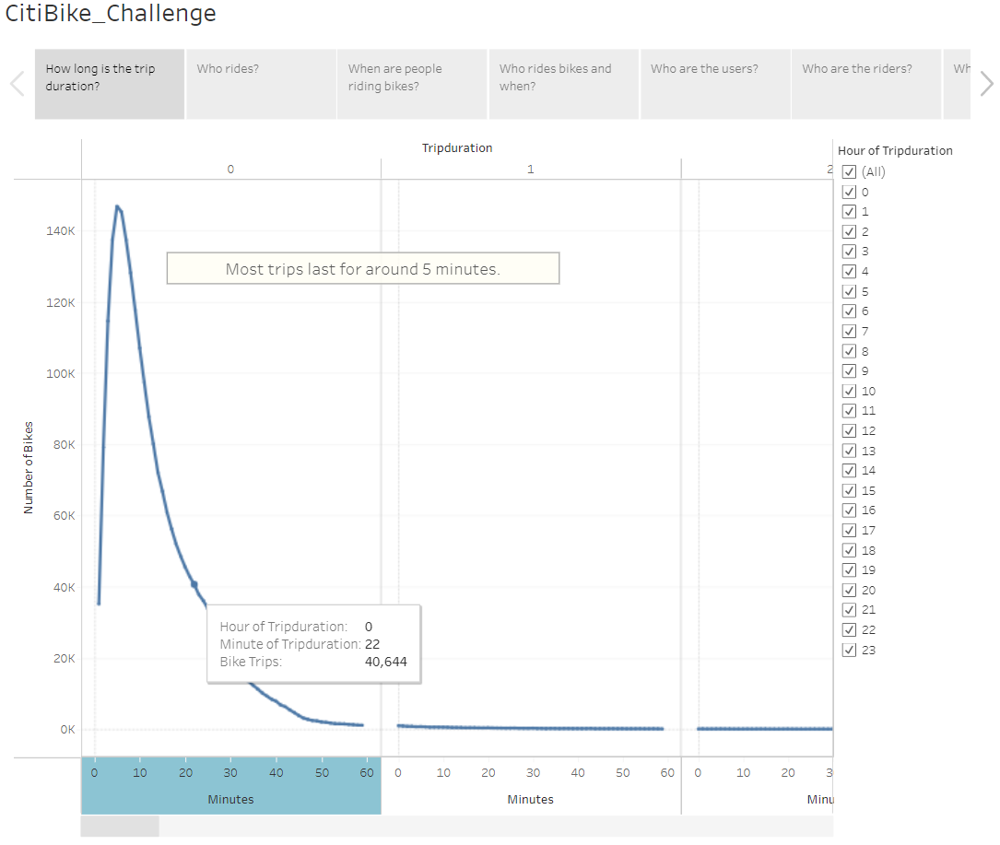
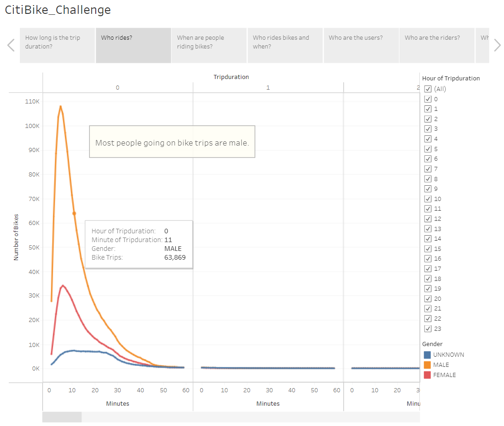
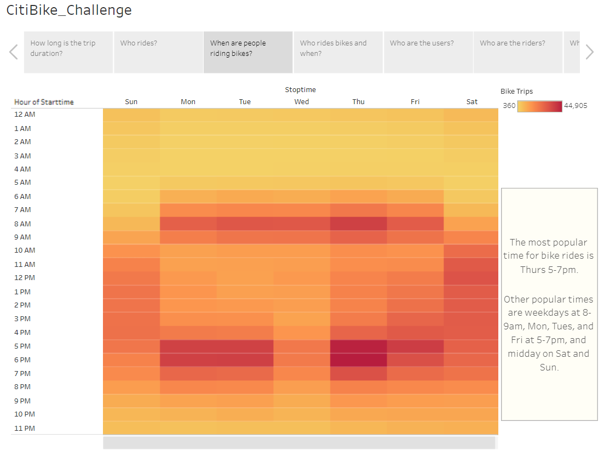
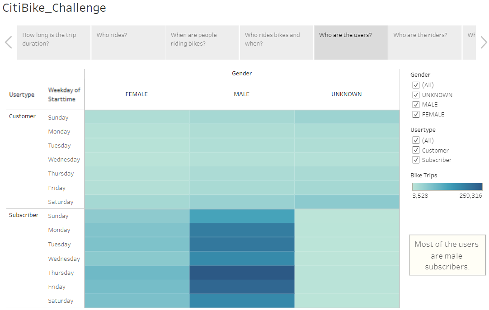
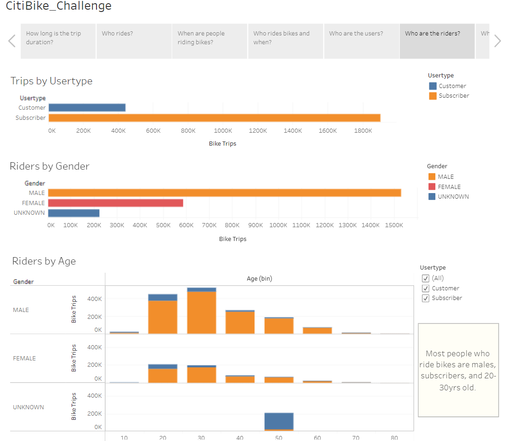
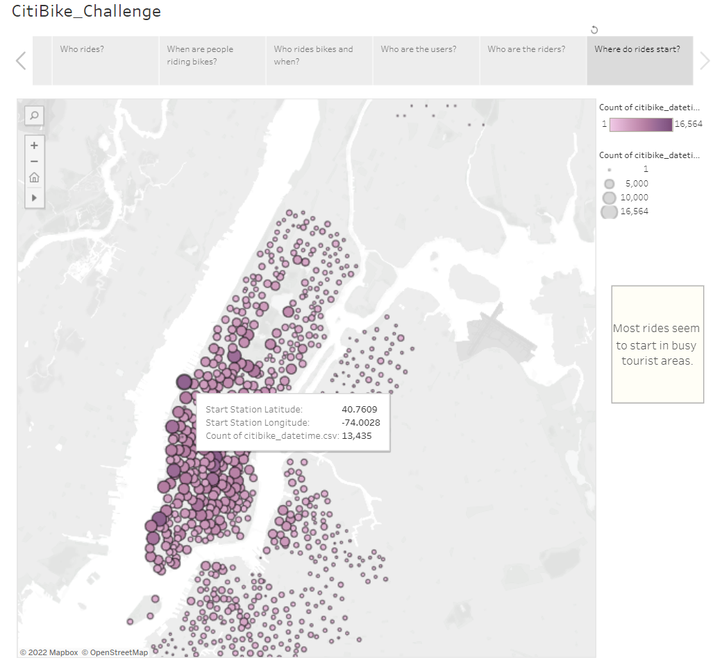

# NY_Citibike
[Link to NY Citibike Tableau Viz](https://public.tableau.com/views/CitiBikeChallenge_16644245015620/CitiBike_Challenge?:language=en-US&:display_count=n&:origin=viz_share_link)

## Purpose
Convince investors that a bike-sharing program in Des Moines is a solid business proposal using a bike trip analysis.
Data visualizations for the analysis will include the following:
- Length of time that bikes are checked out for all riders and genders- 
- Number of bike trips for all riders and genders for each hour of each day of the week
- Number of bike trips for each type of user and gender for each day of the week.

### Change Trip Duration Column Into Datetime Format
#### 1. Check formats of columns

#### 2. Change tripduration into datetime format

#### 3. Check formats of columns

### Tableau Story
#### How Long Is The Trip Duration?

#### Who Rides?

#### When Are People Riding Bikes?

#### Who Rides Bikes And When?

#### Who Are The Users?

#### Who Are The Riders?

#### Where Do Rides Start?

### Tableau NY Citibike Demo
https://youtu.be/qw2tnluetuE
